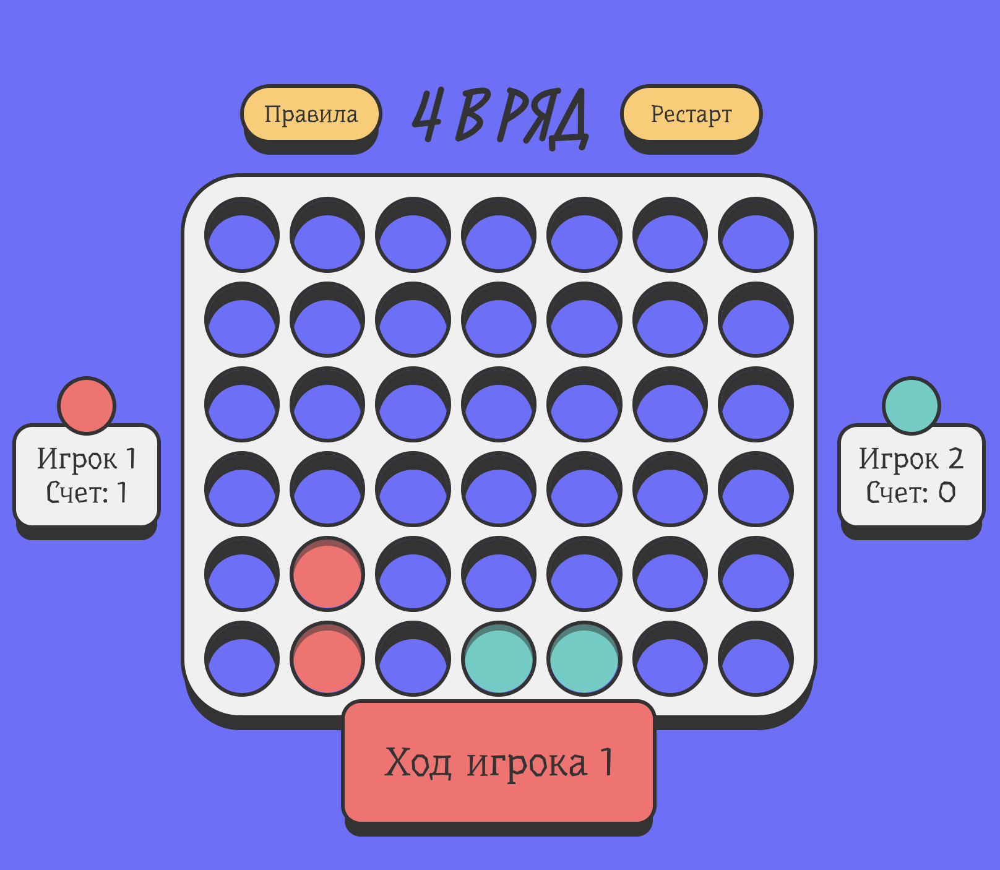

# 🎮 Connect Four

### Игра "Четыре в ряд", реализованная на React и TS.

### 🚀 Поиграть: [https://connect-four-delta.vercel.app/](https://connect-four-delta.vercel.app/)

### 🏃‍♂️ Как запустить

- Установить зависимости: `make install` или `npm install` / `yarn install`
- Запуск в dev-режиме: `make dev` или `npm run dev` / `yarn dev`
- Сборка: `make build` или `npm run build` / `yarn build`

### 🔍 На что обратить внимание при ревью

- **Архитектура** - разделение логики и UI компонентов
- **Типизация** - полное покрытие TypeScript
- **Кастомные хуки**: useGame для управления состоянием игры и useModal для модальных окон.
- **Анимации и UX**: Реализованы с использованием Lottie (JSON-анимации) и framer-motion для плавных переходов.
- **Сборка и проверка качества**: GitHub Workflows для CI (линт/сборка) и CD на Vercel.

### 🛠️ Технологии

- **TypeScript**
- **React + Vite**
- **CSS**
- **Lottie-анимация (JSON)**
- **Framer Motion**

### 📄 Ключевые директории:

- `src/components/` — UI-компоненты (доска, ячейки, меню, панели статуса/счета).
- `src/screens/` - экраны главного меню и игрового поля.
- `src/game-logic/` — логика игры, правила, валидаторы ходов.
- `src/shared/` — хуки, стили, константы, типы, анимации.
